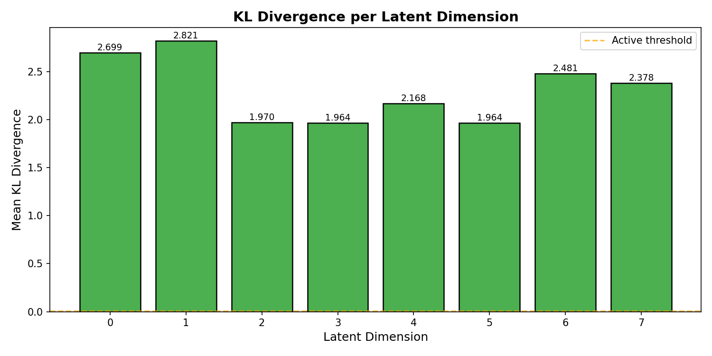

# Variational Autoencoder on FashionMNIST

[](https://www.python.org/)
[](https://pytorch.org/)
[](https://streamlit.io/)

An interactive Variational Autoencoder (VAE) trained on **FashionMNIST** with a Streamlit dashboard for exploring the latent space. Implements **KL annealing** to prevent posterior collapse and provides diagnostic tools for analyzing latent space health.



## Features

- **🧠 Convolutional VAE** — Encoder/Decoder with transposed convolutions for high-quality image reconstruction
- **📉 KL Annealing** — Linear annealing schedule to prevent posterior collapse during training
- **🗺️ Interactive Latent Space Map** — PCA 2D projection of test images colored by class
- **🎛️ Real-time Latent Sliders** — Adjust each latent dimension and see generated images instantly
- **🔍 Reconstruction Viewer** — Compare originals vs reconstructions with error heatmaps
- **📊 KL per Dimension Analysis** — Diagnostic bar chart showing which latent dimensions are active
- **📈 Training Curves** — Reconstruction loss and KL divergence plotted over epochs
- **🐳 Docker Support** — Containerized app for easy deployment

## Project Structure

```
autoencoder/
├── app.py                          # Streamlit interactive dashboard
├── vae_model.py                    # VAE model definition (Encoder, Decoder, VAE)
├── train.py                        # Training script with KL annealing
├── requirements.txt                # Python dependencies
├── Dockerfile                      # Docker image definition
├── docker-compose.yml              # Docker Compose configuration
├── scripts/
│   ├── generate_reconstruction.py  # Generate reconstruction visualizations
│   └── generate_kl_plot.py         # Generate KL per-dimension bar chart
├── results/
│   ├── training_log.csv            # Training metrics per epoch
│   ├── kl_per_dimension.png        # KL divergence per dimension plot
│   ├── analysis.md                 # Written analysis of posterior collapse
│   ├── original_*.png              # Original test images
│   ├── reconstructed_*.png         # Reconstructed test images
│   └── heatmap_*.png               # Error heatmaps
└── models/
    └── vae.pt                      # Trained model checkpoint
```

## Model Architecture

### Encoder
| Layer | Output Shape |
|-------|-------------|
| Conv2d(1→32, 3×3, stride=2) + ReLU | (32, 14, 14) |
| Conv2d(32→64, 3×3, stride=2) + ReLU | (64, 7, 7) |
| Conv2d(64→128, 3×3, stride=2) + ReLU | (128, 4, 4) |
| Flatten + Linear(2048 → latent_dim) | (latent_dim,) — mu & logvar |

### Decoder
| Layer | Output Shape |
|-------|-------------|
| Linear(latent_dim → 2048) + Reshape | (128, 4, 4) |
| ConvTranspose2d(128→64, 4×4, stride=2) + ReLU | (64, 8, 8) |
| ConvTranspose2d(64→32, 4×4, stride=2) + ReLU | (32, 16, 16) |
| ConvTranspose2d(32→1, 4×4, stride=2) + Sigmoid + Interpolate | (1, 28, 28) |

## Setup

### Local Installation

```bash
# Clone the repository
git clone https://github.com/rajesh00618/variational-autoencoder.git
cd variational-autoencoder

# Create and activate a virtual environment
python3 -m venv .venv
source .venv/bin/activate

# Install dependencies
pip install -r requirements.txt
```

### Docker

```bash
docker-compose up --build
```

The app will be available at `http://localhost:8501`.

## Training

Train the VAE from scratch:

```bash
python train.py --epochs 50 --latent-dim 8 --batch-size 128 --lr 1e-3
```

### Arguments

| Argument | Default | Description |
|----------|---------|-------------|
| `--epochs` | 50 | Number of training epochs |
| `--latent-dim` | 8 | Latent space dimensionality |
| `--batch-size` | 128 | Training batch size |
| `--lr` | 1e-3 | Learning rate |
| `--num-annealing-epochs` | 20 | Epochs for KL annealing ramp-up |
| `--seed` | 42 | Random seed |

The training log is saved to `results/training_log.csv` and the model checkpoint to `models/vae.pt`.

## Running the App

```bash
source .venv/bin/activate
streamlit run app.py
```

Open `http://localhost:8501` in your browser.

### App Tabs

1. **🗺️ Latent Space Map** — PCA 2D projection of all test images; click an index to see reconstruction
2. **🖼️ Reconstruction Viewer** — Random reconstructions with error heatmaps and batch comparison
3. **📊 KL per Dimension** — Diagnostic bar chart showing which latent dimensions are active vs dead
4. **📈 Training Curves** — Reconstruction loss and KL divergence over epochs

### Sidebar Controls

- **Latent dimension sliders** — Adjust each `z[i]` value and see the generated image update in real-time
- **Reset All Sliders** — Reset all dimensions to zero

## Scripts

### Generate KL Per-Dimension Plot

```bash
python scripts/generate_kl_plot.py
```

Saves `results/kl_per_dimension.png` — a bar chart showing mean KL divergence for each latent dimension. Dimensions with KL < 0.01 are considered "dead" (posterior collapse).

### Generate Reconstruction Visualizations

```bash
python scripts/generate_reconstruction.py --index 10
```

Saves `results/original_<index>.png`, `results/reconstructed_<index>.png`, and `results/heatmap_<index>.png`.

## Results

### Training Summary (10 epochs)

| Epoch | Beta | Test Recon Loss | Test KL |
|:-----|:----:|:---------------:|:-------:|
| 1 | 0.050 | 232.99 | 32.15 |
| 5 | 0.250 | 225.43 | 21.92 |
| 10 | 0.500 | 224.39 | 18.44 |

### Posterior Collapse Analysis

All **8 latent dimensions are active** (KL > 0.01), meaning no posterior collapse occurred. KL annealing effectively prevented the decoder from ignoring the latent code.

See [results/analysis.md](results/analysis.md) for a detailed write-up on posterior collapse diagnosis and mitigation.

## Dependencies

- **PyTorch** ≥ 2.0.0 — Deep learning framework
- **Torchvision** ≥ 0.15.0 — Dataset loading and transforms
- **Streamlit** ≥ 1.28.0 — Interactive web dashboard
- **scikit-learn** ≥ 1.3.0 — PCA dimensionality reduction
- **Plotly** ≥ 5.17.0 — Interactive scatter plots
- **Matplotlib** ≥ 3.7.0 — Static visualizations
- **Pandas** ≥ 2.0.0 — Data manipulation
- **NumPy** ≥ 1.24.0 — Numerical computing

## License

MIT
